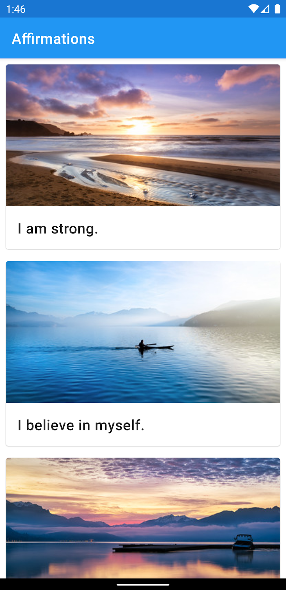

# HW_Week04_Day02
The Home Work has to be delievered before 9AM ⚠️
# What you'll build 📋
## A polished Affirmations app that uses a `RecyclerView` to display a list of cards. Each card contains an image and affirmation text.

## You will display the text and image for each affirmation within a card, using the `MaterialCardView` widget from the Material Components for Android library. Then you will finish the app by polishing the UI to create a more cohesive and beautiful user experience. This is a screenshot of the completed app:

# Learning Resources  📚
* [Android Recyclerview](https://developer.android.com/guide/topics/ui/layout/recyclerview)
* [Android CardView](https://developer.android.com/guide/topics/ui/layout/cardview)
* [Android Fragments](https://developer.android.com/guide/fragments)

